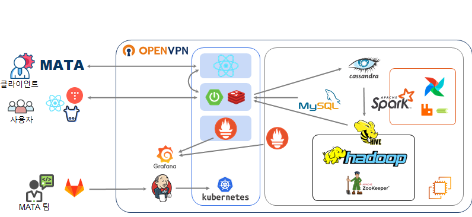
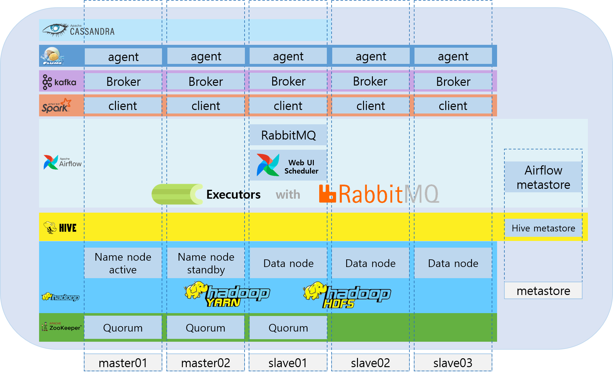
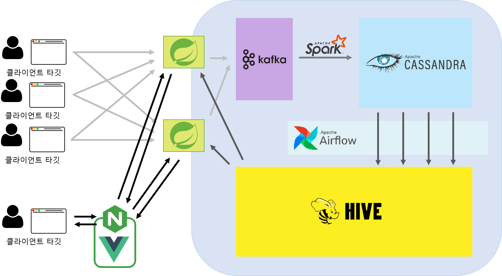

# SSAFY 자율 프로젝트

## 팀 마타(A309)

# 🌐 MATA 링크 : [대시보드 링크](http://mata2.co.kr/)

# 📆 프로젝트 진행 기간

# 2023/04/10 ~ 2023/05/19

# 📖 MATA 는 무엇인가요?

## 🗻Our Vision

웹 페이지의 UX를 향상시키기 위해 고객의 동선을 파악하여

고객 여정 지도를 그리는 것은 비즈니스 차원에서 필수입니다.

서비스에 접근하는 모든 고객의 동선을 수집하여 이를 자동화 하고  

클라이언트의 각종 업무를 돕는것이 MATA의 역할입니다.

## 🎯Our Solution

웹 사이트 이용자의 사이트 내 동선 데이터를 수집합니다.  

수집된 데이터를 처리, 변환하여 적재합니다.  

사이트 관리자 및 운영자에게 사이트 내 흐름에 대한 시각화 정보를 제공합니다.

## 💎Our Value

웹 사이트의 발전과 성장을 위한 인사이트를 제공합니다.

# 💜 주요 기능

---

### 마타 메인보드 화면

### 대시보드 화면 및 컴포넌트 별 통계

### 고객여정지도 별 통계

# ✔ 주요 기술

---

**Data cluster - Hadoop Ecosystem**

Hadoop

Zookeeper

Kafka

Spark

Cassandra

Hive

Airflow

MySQL

**Backend - Spring**

Spring Boot

Spring Web

JPA

JDBC Template

JWT

Spring Security

Spring for Kafka

**Frontend**

React

Bootstrap

Tailwind

**Database**

MySQL

Redis

Hive

**CI/CD**

AWS EC2

NginX

Jenkins

Docker

Docker Compose

Kubernetes

# ✔ 프로젝트 아키텍쳐

---

## MATA Architecture

## Data Cluster Architecture

## Data Flow

# ✔ 프로젝트 구조

---

## 디렉토리 설명

### `react-app`

- React 애플리케이션
- 웹사이트 로그 생성 역할
- 테스트용 서버

### `bigdata-api`

- Springboot 애플리케이션
- React 앱 혹은 html에서 전달된 데이터를 받아오고 접근 권한을 부여하는 역할
- Kafka server에 데이터를 넘겨주는 역할
- Hive, MySQL 등 DB에서 API를 통해 데이터를 조회하는 역할

### `mata2`

- React 애플리케이션
- 대쉬보드 페이지 서버

### `hadoop-cluster`

- Hadoop Ecosystem 스크립트
- Kafka, Hive, Airflow 등 다양한 툴을 가지는 분산 데이터 플랫폼
- Docker 기반 분산 운영

### `Docs`

- 개인공부, 회의록 등 문서를 정리한 공간

# ✔ 협업

---

### Jira 를 통한 협업

- 프로젝트를 진행하며 1주당 하나의 스프린트, 총 5개의 스프린트를 진행
- 한 주의 시작마다 인당 총 40시간의 이슈를 생성하고 스프린트를 시작
- 1~4시간의 이슈를 생성하여 작업을 시작할 때 마다 해당 이슈를 진행중 표시
- 작업이 완료 되면 해당 이슈를 완료 표시 한 후, 다음 작업을 진행
- 한 주의 마지막에 스프린트를 종료하여 리뷰하는 시간을 가짐

### Gitlab 을 통한 협업

- master, develop, feature의 git flow 브랜칭 전략을 통해 작업 브랜치를 분할 관리
- 새로운 기능 개발이나 버그픽스를 위해 feature 브랜치를 사용
- 개발 현황을 병합하고 새로운 개발 브랜치를 분기하기 위해 develop 브랜치를 사용

# ✔ 팀원 역할 분배

---

### 정준호 (팀장)

`Frontend` `Backend` `Workflow Management`

- Airflow Dag 작성
- Data Workflow 자동화
- Hive 데이터 조회 쿼리 작성
- React 기반 여정지도 컴포넌트 개발
- Hive ERD 설계
- Spark SQL 쿼리 작성

### 이태희

`Frontend` `Backend` `Data Warehouse`

- Spring boot 기반 회원, 프로젝트 도메인 API 작성
- React 기반 히트맵 컴포넌트 개발
- Cassandra To Hive를 위한 Spark스크립트 작성
- UCC 제작
- ERD 제작

### 김호성

`Frontend`  `Data Warehouse`

- React app 개발
- React rechart, grid-layout 기반 대시보드 컴포넌트 개발
- Cassandra To Hive를 위한 Spark스크립트 작성

# 

### 이진욱

`Frontend` `Backend`

- Spring boot 기반 회원, 프로젝트 도메인 API 작성
- React 기반 대시보드 컴포넌트 개발
- Ucc 촬영 및 편집

### 함형준

`Frontend` `Backend` `Workflow Management`

- Airflow Dag 작성
- Data Workflow 자동화
- Hive 데이터 조회 쿼리 작성
- 쿠버네티스 클러스터 구성 및 CI/CD 인프라 구축
- 롤링 업데이트 구축
- Hive ERD 설계
- SparkSQL 쿼리 작성
- Spring boot 분리 작업
- Ucc 출연

# ✔ 프로젝트 산출물

---

- [서비스 ERD](Docs/서비스%20ERD.png)
- [Hive ERD](Docs/Hive%20ERD.png)
- [서비스 API 목록](Docs/API%20목록.html)
- [최종 발표 PPT]()
- [포딩 매뉴얼](Docs/포딩매뉴얼.docx)

# 📊 MATA 대시보드 화면

---
